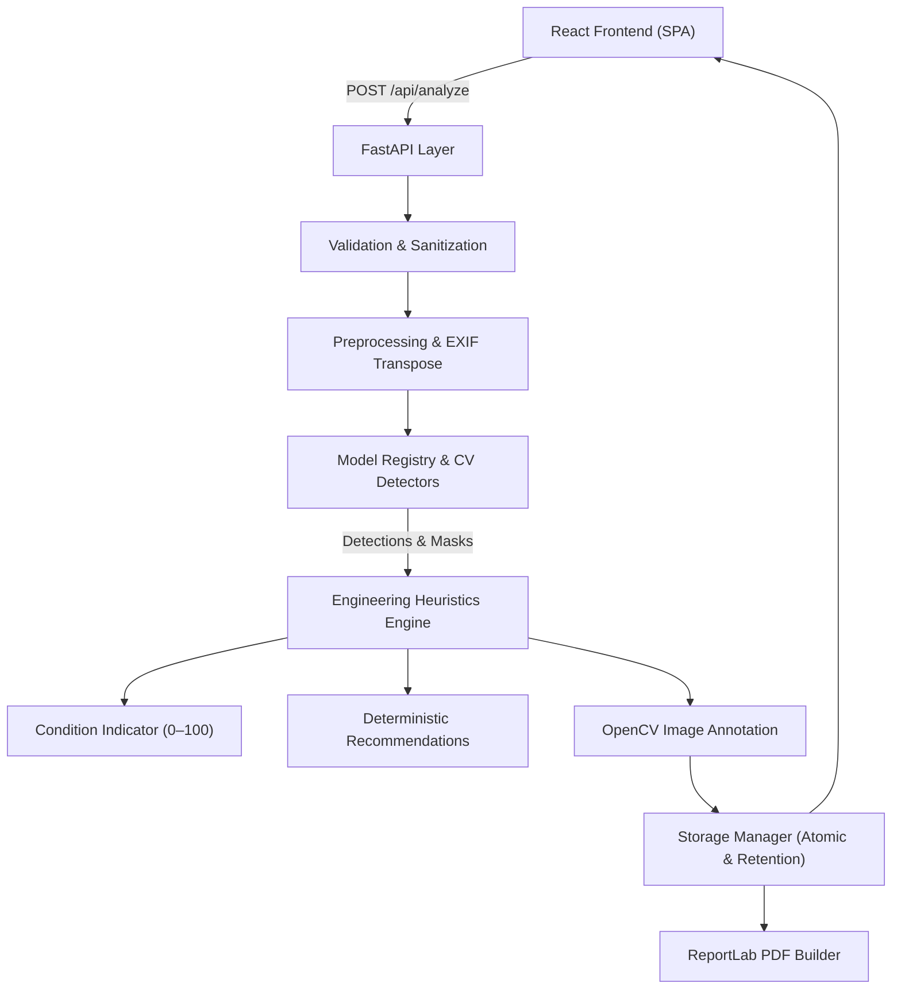

# CiviSight AI — System Architecture & Design

This document details the architectural layout, components, data flows, and security model of CiviSight AI.

---

## 1. System Overview

CiviSight AI couples modern computer vision inference with deterministic engineering rules and transparent reporting.

---

## 2. Backend Components

### 2.1 API & Presentation Layer (`backend/app/api/`)
- `health.py`: Diagnostics, loaded model status, compute device (`cpu`/`cuda`), and framework versions.
- `analyze.py`: Ingestion of inspection files, dispatch to inference pipeline, and real-time progress tracking.
- `files.py`: Path-traversal-protected streaming of original and annotated JPEG images.
- `report.py`: On-demand deterministic compilation and streaming of auditable ReportLab PDF reports.

### 2.2 Core Infrastructure (`backend/app/core/`)
- `errors.py`: Custom `AppError` taxonomy mapped to consistent JSON error schemas.
- `validation.py`: Strict magic-bytes verification, extension checks, Pillow format verification, and decompression bomb prevention (`MAX_IMAGE_PIXELS = 50_000_000`).
- `storage.py`: Atomic temp-file-to-rename writes, UUID validation against directory traversal, and background 24-hour retention cleanup.
- `progress.py`: Thread-safe in-memory store for 4-stage analysis execution tracking.

### 2.3 Computer Vision Layer (`backend/app/cv/`)
- `detectors/base.py`: Formal `Detector` protocol defining the uniform `.predict(bgr_image) -> List[RawDetection]` contract.
- `detectors/crack_classical.py`: Sato multi-scale Hessian ridge filter, CLAHE contrast enhancement, hysteresis thresholding, and morphological filtering.
- `detectors/yolo_detector.py`: Ultralytics YOLOv8 wrapper supporting dynamic inference resolution, confidence thresholds, and class mapping.
- `registry.py`: Dynamic registry that parses `registry.yaml` and initializes appropriate detectors with automatic fallback to classical baselines.
- `annotate.py`: OpenCV rendering engine applying severity-colored bounding boxes, alpha masks, and numbered labels.

### 2.4 Engineering Heuristics Engine (`backend/app/engineering/`)
- `metrics.py`: Normalized coordinates `[0, 1]`, relative area ratios, location grid discretization (9 zones), and skeleton relative lengths.
- `severity.py`: Rule-based classification for cracks and potholes with count-based escalation.
- `safety.py`: Geometric head-region association pairing people with visible hard-hat detections.
- `condition.py`: Deterministic condition index calculations (`defect_v1` and `safety_v1`) producing 0–100 indicators with clear penalty factor accounting.
- `recommendations.py`: Deterministic mapping from visual findings to actionable engineering recommendations.

---

## 3. Frontend Architecture

### 3.1 Stack
- **Framework:** React 18 + TypeScript + Vite.
- **Styling:** Tailwind CSS with custom design tokens matching civil engineering severity palettes:
  - Low severity: Emerald (`#15803D`)
  - Moderate severity: Amber (`#B45309`)
  - High severity: Red (`#B91C1C`)
  - Primary Brand: Navy (`#1E3A8A`)
- **Interactive Inspection:** `react-zoom-pan-pinch` for deep-zoom examination of defects.
- **Client Storage:** `localStorage` history repository with export and download capabilities.

---

## 4. Security & Robustness Measures

1. **Path Traversal Defense:** Storage operations strictly enforce hex UUID pattern validation before resolving disk paths.
2. **Decompression Bomb Protection:** Image dimensions and total pixel count are verified before decompression.
3. **EXIF Stripping:** Uploaded photos are normalized for EXIF rotation and re-encoded to sanitized JPEGs, stripping all location and camera metadata.
4. **No Artificial Latency:** All pipeline timings reflect real CPU/GPU inference time; progress updates poll actual stage transitions.
